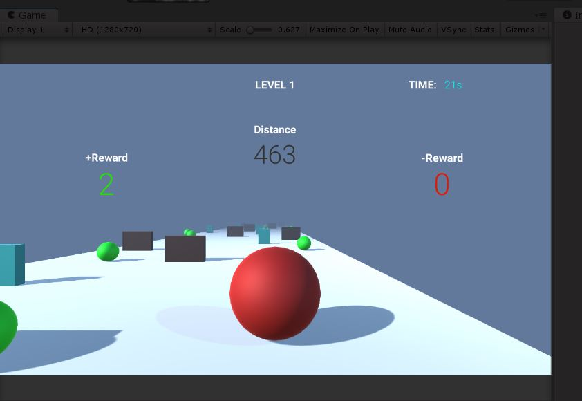
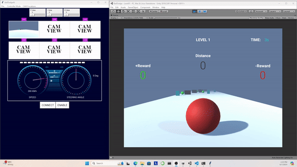

# BallNavigator: A Unity Game for Training Neural Networks

## Overview

BallNavigator is a Unity game where players control a ball using the arrow keys on their keyboard to navigate through various obstacles and reach a goal. The game includes a camera attached to the ball, capturing images of the ball's perspective similar to a self-driving car. These images, along with the input commands used to control the ball, can be used to train a convolutional neural network (CNN) to predict the direction the ball should take automatically to avoid obstacles.

## Features

- **Ball Control:** Use the arrow keys to navigate the ball through obstacles to reach the goal.
- **Camera View:** A camera attached to the ball captures images of the ball's surroundings.
- **Data Collection:** Images and input commands can be collected via a Python interface for training a CNN.
- **Obstacle Navigation:** Multiple obstacles to test the ball's navigation capabilities.
- **Unity and Python Integration:** The game is developed using Unity game engine with C# and Python for the interface.

## Installation

To run BallNavigator, you need to have the Unity game engine installed. You can download and install Unity from [Unity's official website](https://unity.com/).

## Running the Game

1. **Download the Repository:**
   Clone or download this repository to your local machine.

2. **Open the Project:**
   Open Unity, then go to `File > Open Project` and select the downloaded project folder.

3. **Play the Game:**
   Once the project is loaded, press the `Play` button in the Unity Editor to start the game.

## Data Collection for Neural Network Training

The game includes a Python interface to collect images from the camera and the corresponding input commands. This data can be used to train a convolutional neural network to automate the ball's navigation.

## Demonstration

Check out the GIF demonstration of the game below:

## License

This project is licensed under the MIT License.

---
